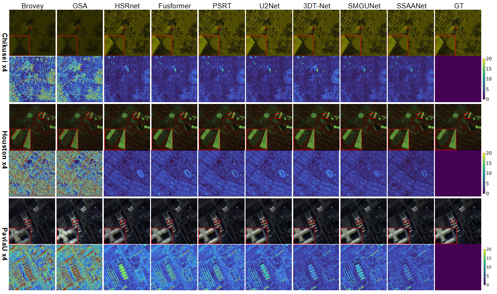

# SSAANet: Efficient Spectral-Spatial Adaptive Alignment Network for Hyperspectral and Multispectral Image Fusion

[](LICENSE)
[]()
[]()

## 📖 Abstract
Multispectral hyperspectral image fusion (MFIF) fuses high-resolution multispectral images (HR-MSI) with low-resolution hyperspectral images (LR-HSI) to generate high-resolution hyperspectral images (HR-HSI). However, existing fusion models often rely on computationally intensive units, such as 3D CNNs or self-attention mechanisms, to simultaneously capture spatial texture and spectral sequence features in spectral images. This leads to modality conflicts and high computational costs. To address these challenges, we propose a novel adaptive alignment-based multispectral-hyperspectral image fusion method, named Spectral-Spatial Adaptive Alignment Network (SSAANet), designed to efficiently fuse and align features. To effectively capture spatial texture and spectral sequence features, we introduce a lightweight deformable spatial and spectral feature extraction module, which utilizes displacement vectors to guide the network in extracting complementary spatial and spectral features. Regarding spatial-spectral feature alignment, SSAANet successfully overcomes issues such as large spans and inaccurate deformation field prediction during single-step alignment. Experimental results on multiple datasets validate the superiority of the proposed method.

## 📦 Requirements
- Python 3.8+
- PyTorch 1.6+
- CUDA 11.1+

## 📂Dataset
- [Pavia University](https://www.ehu.eus/ccwintco/index.php/Hyperspectral_Remote_Sensing_Scenes)
- [Chikusei](https://naotoyokoya.com/Download.html)
- [Houston](https://hyperspectral.ee.uh.edu/?page_id=459)

## 🛠️Usage
Place the dataset in the dataset directory, and run the following command:
```bash
python main.py 
```
## Method


**Figure 1.** Overall architecture of the proposed SSAANet. SSRB denotes the Spatial-Spectral Rectification Block, while SSFAB denotes the Spatial-Spectral Feature Alignment Block.  

<br>
<br>


**Figure 2.** Detailed architecture of the proposed Spatial-Spectral Rectification Block (SSRB).  

<br>
<br>


**Figure 3.** Detailed architecture of the proposed Spatial-Spectral Feature Alignment Block (SSFAB).  
<br>
<br>



**Figure 4.** Quantitative comparisons of different approaches were conducted on the Chikusei, Houston, and PaviaU test datasets.
The best results are highlighted in bold, while the second-best results are underlined.
<br>
<br>


**Figure 5.** Comparison of SSAANet and state-of-the-art models in terms of parameter count and computational complexity (FLOPs) for ×4 super-resolution on the PaviaU dataset.
<br>
<br>
<br>
<br>
<br>


